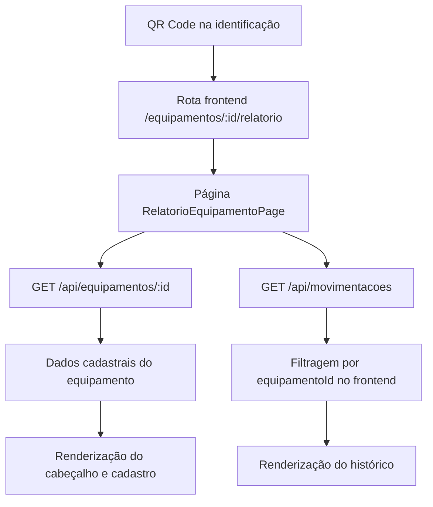
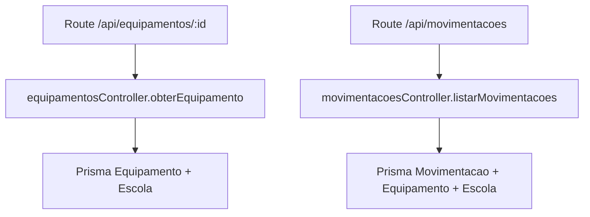
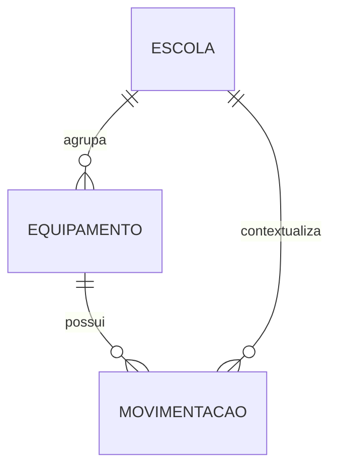

## 1. Desenho Da Arquitetura


## 2. Descrição Técnica
- Frontend: React 18 + TypeScript + Vite + Tailwind CSS
- Roteamento: react-router-dom
- Ícones: lucide-react
- Cliente HTTP: axios já existente em `frontend/src/lib/axios`
- Backend: Node.js + Express + Prisma + MySQL

## 3. Definição De Rotas
| Rota | Objetivo |
|-------|---------|
| `/equipamentos/:id/relatorio` | Exibir relatório detalhado do equipamento acessado pelo QR Code |
| `/equipamentos` | Origem da identificação e ponto de retorno |

## 4. Definições De API
### 4.1 Reaproveitamento De Endpoints Existentes
```ts
type EquipamentoRelatorio = {
  id: string
  nome?: string
  nomeEquipamento?: string
  patrimonio?: string
  usuarioNome?: string
  status?: string
  modelo?: string
  serial?: string
  dataAquisicao?: string
  localizacao?: string
  escolaId?: string
  escola?: { nome?: string; sigla?: string }
}

type MovimentacaoRelatorio = {
  id: string
  equipamentoId: string
  tipo?: string
  origem?: string
  destino?: string
  data?: string
  descricao?: string
  escola?: { nome?: string }
}
```

- `GET /api/equipamentos/:id`
  - Uso: carregar os dados principais do equipamento.
  - Resposta esperada: objeto completo do equipamento com escola.

- `GET /api/movimentacoes`
  - Uso: carregar histórico geral já respeitando o escopo de escola do usuário.
  - Estratégia inicial: filtrar no frontend por `equipamentoId`.
  - Evolução opcional futura: criar endpoint dedicado `GET /api/equipamentos/:id/historico`.

## 5. Diagrama Da Arquitetura Do Servidor


## 6. Modelo De Dados
### 6.1 Modelo Conceitual


### 6.2 Regras De Implementação
- O QR Code da identificação deve deixar de carregar apenas um JSON textual e passar a abrir uma URL absoluta para a página de relatório.
- A nova página deve validar `id` da rota, carregar o equipamento e depois compor o histórico.
- O campo `setor` será representado inicialmente por `localizacao`, preservando a nomenclatura visual pedida pelo usuário.
- O patrimônio deve exibir `00000` quando estiver vazio, mantendo consistência com a identificação.
- O histórico deve ser exibido em ordem decrescente de data, com fallback visual para ausência de registros.
- A página deve respeitar o controle de acesso já aplicado pelos endpoints existentes.
