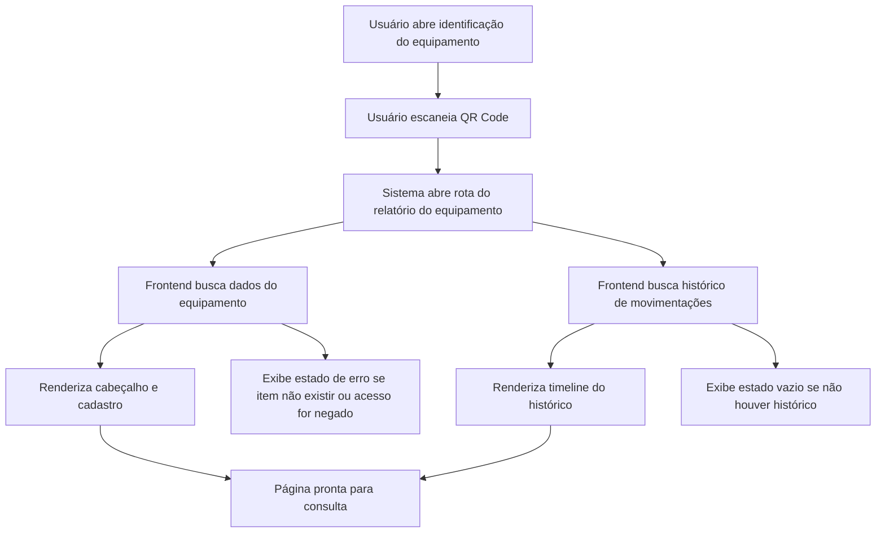

## 1. Visão Geral Do Produto
Tela de relatório moderna aberta a partir do QR Code da identificação do equipamento, com foco em consulta rápida, visual profissional e leitura clara em desktop e mobile.
- Resolve a necessidade de visualizar o resumo cadastral e o histórico completo de um equipamento em uma página única, organizada e pronta para uso operacional.
- Agrega valor ao inventário ao transformar o QR Code em ponto de entrada para auditoria, conferência e rastreabilidade.

## 2. Funcionalidades Principais

### 2.1 Papéis De Usuário
| Papel | Método de acesso | Permissões principais |
|------|-------------------|-----------------------|
| Usuário autenticado | Login no sistema | Visualizar relatório do equipamento permitido pelo escopo da escola |
| Gestor/Admin | Login no sistema | Visualizar qualquer relatório dentro do escopo de acesso e usar em auditoria |

### 2.2 Módulo Funcional
1. **Página de Relatório do Equipamento**: cabeçalho executivo, bloco cadastral, timeline de histórico e ações rápidas.
2. **Integração com QR Code**: QR da identificação passa a apontar para a rota do relatório do equipamento.

### 2.3 Detalhamento Da Página
| Nome da página | Nome do módulo | Descrição da funcionalidade |
|-----------|-------------|---------------------|
| Relatório do Equipamento | Cabeçalho | Exibe ID, nome do equipamento e status atual com destaque visual |
| Relatório do Equipamento | Resumo cadastral | Exibe modelo, número de série, patrimônio, data de aquisição, setor e usuário |
| Relatório do Equipamento | Bloco de contexto | Exibe escola, localização atual, validade e metadados úteis de apoio |
| Relatório do Equipamento | Histórico do equipamento | Lista cronológica de movimentações com tipo, origem, destino, data e descrição |
| Relatório do Equipamento | Estados de interface | Trata carregamento, não encontrado, sem histórico e erro de carregamento |

## 3. Fluxo Principal
O usuário abre a identificação do equipamento, lê o QR Code e é direcionado para uma rota dedicada do sistema. A página carrega os dados detalhados do equipamento e seu histórico de movimentações, exibindo tudo em uma interface moderna e responsiva. Caso o equipamento não exista ou não esteja no escopo do usuário, a página mostra estado de erro apropriado.

## 4. Design Da Interface
### 4.1 Estilo Visual
- Cor principal: fundo escuro sofisticado com cards em contraste claro e acentos em azul petróleo, verde de status e cinza técnico.
- Estilo dos botões: botões discretos com borda suave, foco em leitura e ação secundária.
- Tipografia: título com fonte de personalidade forte e corpo com fonte altamente legível.
- Layout: desktop-first com hero superior, cards modulares e timeline vertical elegante.
- Ícones: ícones lineares técnicos, sem excesso decorativo, reforçando status e rastreabilidade.

### 4.2 Visão Da Página
| Nome da página | Nome do módulo | Elementos de UI |
|-----------|-------------|-------------|
| Relatório do Equipamento | Cabeçalho | faixa destacada com ID, nome, badge de status, contexto da escola |
| Relatório do Equipamento | Resumo cadastral | grid de cards curtos com rótulo, valor e microdetalhes |
| Relatório do Equipamento | Histórico | timeline com chips de tipo, datas, origem, destino e observações |
| Relatório do Equipamento | Estado vazio/erro | cards informativos com CTA de retorno |

### 4.3 Responsividade
- Abordagem desktop-first.
- Em telas largas, o cabeçalho e o bloco cadastral ficam distribuídos em colunas.
- Em telas menores, os cards empilham verticalmente e a timeline mantém boa leitura.
- Interações e áreas clicáveis devem ser amigáveis ao toque.
